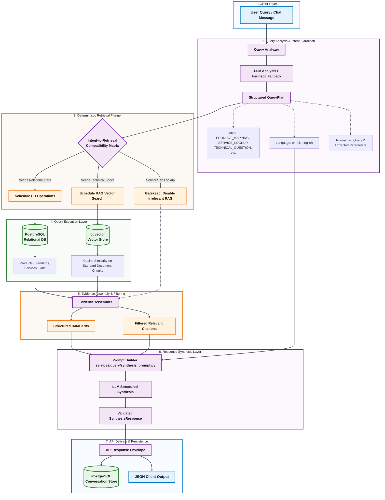

<div align="center">

# Smart India Hackathon (SIH 2026) Prototype
## Bureau of Indian Standards (BIS) Intelligent Assistant

<p align="center">
  
</p>

[](https://sih.gov.in)
[](./QuickStart.md)
[](https://python.org)
[](https://github.com/pgvector/pgvector)
[-black?style=for-the-badge)](https://ollama.com)
[](./docker-compose.yml)

*An AI-powered conversational assistant for Indian Standards (IS), conformity assessment, BIS product certification schemes, testing laboratories, and official BIS services.*

</div>

---

> [!WARNING]
> ### ⚠️ SIH 2026 Prototype & Security / Latency Notice
> **This repository is a Proof of Concept (PoC) / MVP developed under intense time constraints for Smart India Hackathon (SIH 2026).**
> 
> * **Not Production Hardened**: This software is an architectural prototype created to validate deterministic RAG routing and structured querying over official BIS datasets. It is **not designed for enterprise production security**, lacks multi-tenant auth / authorization, and does not implement production hardening or DDoS protection.
> * **Latency Considerations**: LLM inference runs via Ollama (`qwen3:8b`) either on local hardware or remote cloud tunnels. Synthesis requests typically take **15–45 seconds** depending on GPU availability. It is **not optimized for sub-second production SLAs**.

---

## 1. Quick Navigation

* 🚀 [**Quick Start Guide**](./QuickStart.md) — 5-minute setup with virtualenv, Docker, and Colab/Kaggle
* 📬 [**API Collections Guide (Insomnia / Postman)**](./api_collections/README.md) — Pre-configured request collections
* 🧪 [**Testing Guide**](./tests.md) — Architecture, service fixtures, and running the CI feature test suite
* 🔍 [**E2E System Testing Harness**](./tests/e2e/README.md) — Standalone real-world validation against live Ollama LLM
* 📓 [**Google Colab Model Notebook**](./Collab-BIS-Model.ipynb) | [**Kaggle Model Notebook**](./Kaggle-BIS-Model.ipynb)

---

## 2. Overview

The **BIS Intelligent Assistant** delivers accurate, authoritative, and hallucination-free answers to technical, regulatory, and procedural questions regarding Indian Standards. It combines a natural-language Query Analyzer with a **deterministic retrieval planner**, structured relational querying (PostgreSQL), vector-based document retrieval (`pgvector`), and grounded response synthesis.

### Key Capabilities
* **Standard Lookup & Mapping**: Maps products (e.g., PVC insulated cables, packaged drinking water, structural steel) to official Indian Standards (e.g., IS 694, IS 14543, IS 2062).
* **Certification & Scheme Guidance**: Clarifies mandatory Quality Control Orders (QCOs), Scheme I (ISI Mark), FMCS, and Compulsory Registration Scheme (CRS).
* **Laboratory Discovery**: Identifies recognized BIS testing laboratories by location and scope.
* **Service Lookup**: Delivers structured service details, eligibility criteria, and fee structures from official BIS service records.
* **Deterministic Retrieval Routing**: Eliminates expensive per-hop LLM controller loops in favor of predictable, rule-based multi-hop retrieval.
* **Authoritative Citations & DataCards**: Emits structured cards (`StandardCard`, `CertificationCard`, `ServiceCard`, `LaboratoryCard`) and verifiable inline document citations (`<cit_1>`).
* **Multilingual Preservation**: Native support for queries and synthesis in Hindi and English.

---

## 3. Query Flow Architecture

The diagram below illustrates the end-to-end processing pipeline—from the raw user message through intent analysis, deterministic DB/RAG routing, evidence assembly, structured response synthesis, and conversation persistence:



---

## 4. AI Model Setup (Local GPU vs. Google Colab / Kaggle)

The assistant relies on **Ollama** running `qwen3:8b`.

### Option A: Local PC with Dedicated GPU ($\ge 8\text{ GB}$ VRAM)
If you have an NVIDIA GPU (e.g. RTX 3060/4060 or higher):
```bash
ollama serve
ollama pull qwen3:8b
```
Configure your `.env`:
```ini
MODEL_URL=http://localhost:11434
MODEL_NAME=qwen3:8b
AI_PROVIDER=OLLAMA
```

### Option B: No Local GPU? Use Google Colab or Kaggle (Free GPU Tunnels)
Running 8B models on CPU will cause extreme latency. Use the provided notebooks:
* [`./Collab-BIS-Model.ipynb`](./Collab-BIS-Model.ipynb) (Google Colab)
* [`./Kaggle-BIS-Model.ipynb`](./Kaggle-BIS-Model.ipynb) (Kaggle)

1. Open the notebook in Colab/Kaggle and enable a GPU runtime (T4/P100).
2. Run all cells to launch Ollama and an encrypted Cloudflare tunnel.
3. Copy the tunnel URL (e.g. `https://<subdomain>.trycloudflare.com`) and paste into `.env`:
   ```ini
   MODEL_URL=https://<subdomain>.trycloudflare.com
   MODEL_NAME=qwen3:8b
   AI_PROVIDER=OLLAMA
   ```

---

## 5. Startup Commands

For detailed step-by-step setup, see the [**Quick Start Guide**](./QuickStart.md).

### Application Stack (Docker Compose)
The application is containerized via [`./Dockerfile.app`](./Dockerfile.app) and [`./docker-compose.app.yml`](./docker-compose.app.yml). Startup combines both compose files at once:

```bash
# Build and launch both PostgreSQL and the BIS Assistant application:
docker compose -f docker-compose.yml -f docker-compose.app.yml up -d --build
```

* **Tesseract OCR**: Included by default in the app image. To skip OCR installation during build, use:
  ```bash
  docker compose -f docker-compose.yml -f docker-compose.app.yml build --build-arg INSTALL_OCR=false
  docker compose -f docker-compose.yml -f docker-compose.app.yml up -d
  ```
* **Verify Health**:
  ```bash
  curl http://127.0.0.1:5000/v1/health
  ```
* **Stop Application**:
  ```bash
  docker compose -f docker-compose.yml -f docker-compose.app.yml down
  ```

---

### Running Automated Tests (Database Only)
> [!NOTE]
> **Tests do NOT require the application container.** Only the PostgreSQL database is needed.

1. **Start only the PostgreSQL database**:
   ```bash
   docker compose up -d
   ```
2. **Apply migrations**:
   ```bash
   alembic upgrade head
   ```
3. **Run fast feature tests**:
   ```bash
   pytest tests/features/ -v
   ```
4. Complete testing architecture and fixture organization are documented in [**Testing Guide**](./tests.md).

---

## 6. End-to-End System Tests

To validate the entire real-world system (real Ollama model, PostgreSQL, and HTTP API server):

```bash
python tests/e2e/run_e2e.py
```

* Executes 3 realistic multi-turn conversation scenarios (maximum 10 total questions).
* Generates a timestamped JSON validation report in [`./tests/e2e/results/`](./tests/e2e/results/).
* Full details can be found in the [**E2E Testing Guide**](./tests/e2e/README.md).

---

## 7. Data Quality & Clarification Limitations

The assistant operates under strict **hallucination prevention rules**:

1. **Zero Fabrication**: If a user asks for specific laboratories, fee schedules, or standards that do not exist in the database (e.g. asking for accredited testing labs for an unsupported product category), the deterministic planner records `0 records found` and halts retrieval.
2. **Deterministic Fallback**: In such cases, the system intentionally does **not** fabricate fictitious laboratory names, invent clarification options, or force unrelated RAG document chunks into the answer.
3. **Behavioral Impact**: The assistant will respond clearly stating that no matching records were found in official BIS data, and will request additional product details.
4. **Resolution Path**: Improving responses for edge cases requires expanding the underlying dataset (via `python -m db.seed`) rather than modifying the retrieval pipeline to guess missing information.

---

## 8. API Reference

Pre-configured request collections for **Insomnia** and **Postman** are located in [`./api_collections/`](./api_collections/). See the [**API Collections Guide**](./api_collections/README.md) for import instructions.

### Health Check
```http
GET /v1/health
```
```json
{
  "success": true,
  "data": "BIS Intelligent agent is healthy",
  "error": null
}
```

### Conversational Query
```http
POST /v1/query
Content-Type: application/json
```
```json
{
  "conversation_id": null,
  "message": {
    "content": "What services does BIS provide?",
    "language": "en"
  }
}
```
```json
{
  "success": true,
  "data": {
    "conversation_id": "conv_3543098ca1",
    "message_type": "answer",
    "message": "The Bureau of Indian Standards (BIS) provides several certification and registration services...",
    "citations": [],
    "data": [
      {
        "data_type": "service",
        "id": "srv_001",
        "name": "Grant of BIS Product Certification Licence (ISI Mark)",
        "service_type": "Product Certification",
        "description": "Licence granting use of standard mark...",
        "source_url": "https://bis.gov.in/service/isi-mark"
      }
    ],
    "questions": null
  },
  "error": null
}
```
